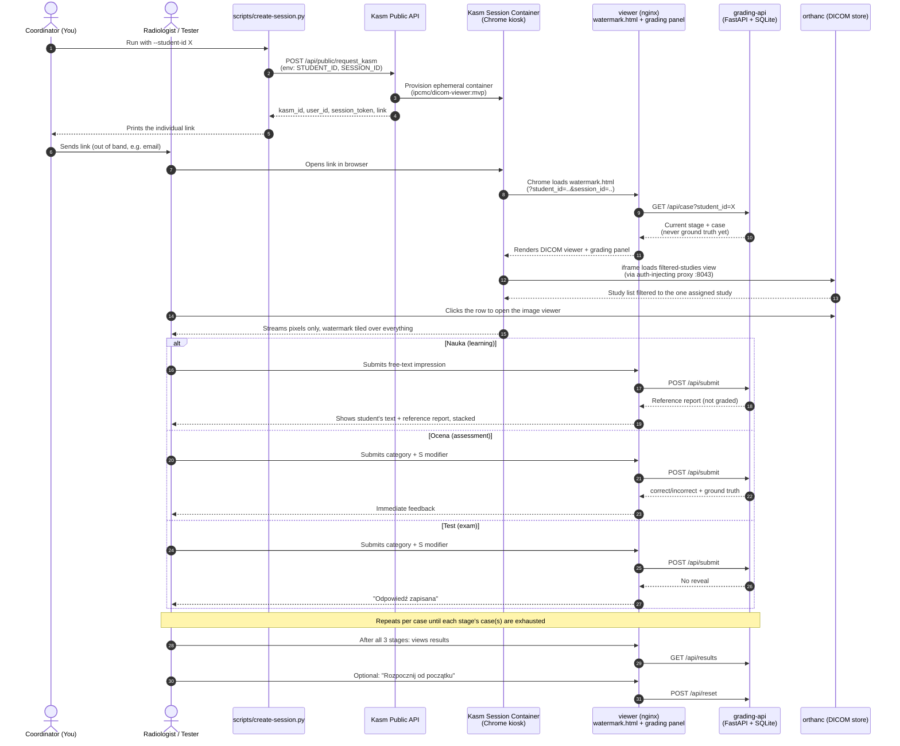
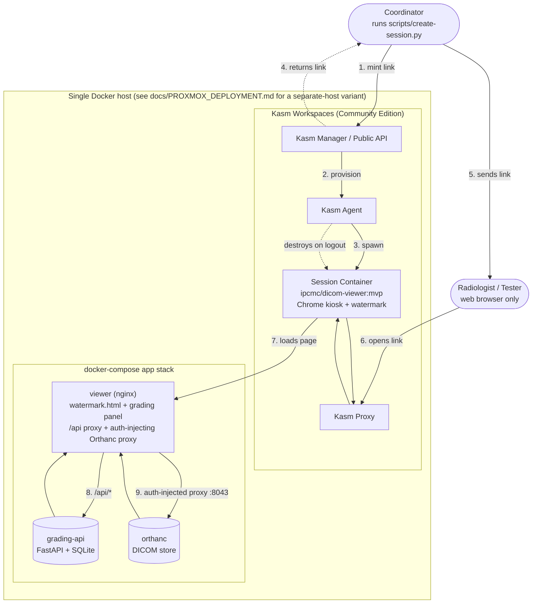

# Architecture — current state

**This describes what's actually built and running today**, not the
target/future system. For what's deliberately deferred (Moodle, payments,
real stratified sampling, certificates, admin dashboard), see README.md's
"What's NOT in this MVP" section and CLAUDE.md's hard rules — not
duplicated here to avoid the two documents drifting apart again.

## Session flow

Key differences from the original design discussion in `Dokumentacja/`
worth calling out explicitly: no Moodle launches this (a coordinator runs
`create-session.py` by hand), no payment gate, no LTI grade passback, and
`GET /case` / `POST /submit` enforce that ground truth and the reference
report are never sent to the browser before the stage that's supposed to
reveal them — that rule lives in `grading-api/app/main.py`, not just this
diagram.

## Deployment topology

"Single Docker host" is currently this dev laptop, not yet anything
reachable from the GUMed/UCK network — see `docs/PROXMOX_DEPLOYMENT.md`
for the separate-host variant. Kasm Workspaces is installed as Community
Edition, which comes with real licensing constraints (non-commercial-use
restriction, 5-concurrent-session cap) — see CLAUDE.md's hard rules, not
this diagram, for the authoritative statement of those.

Notes on what this diagram deliberately does *not* show, because it
doesn't exist yet: Moodle, a payment gateway, LTI Advantage, a
Postgres/stratified-sampling layer, a Proxmox cluster (this is one host).
Each of those is a real, tracked gap — see README.md and CLAUDE.md, not
this diagram, for the authoritative list so the two don't drift apart.

Separately, a **Weasis-based session flow is being built alongside this
one** (milestone "Weasis viewer migration", GitHub issues #3-#8) — a second
Kasm workspace image (`docker/kasm-workspace-weasis/`) exists and is
verified to launch Weasis correctly, but it isn't wired into any live
session yet (no auto-launch against an assigned study, no grading panel,
no watermark overlay for it). Both diagrams above still describe the
Chrome+Orthanc flow because that's the only one actually running
end-to-end today; they'll be redrawn once the Weasis flow reaches the same
point.
