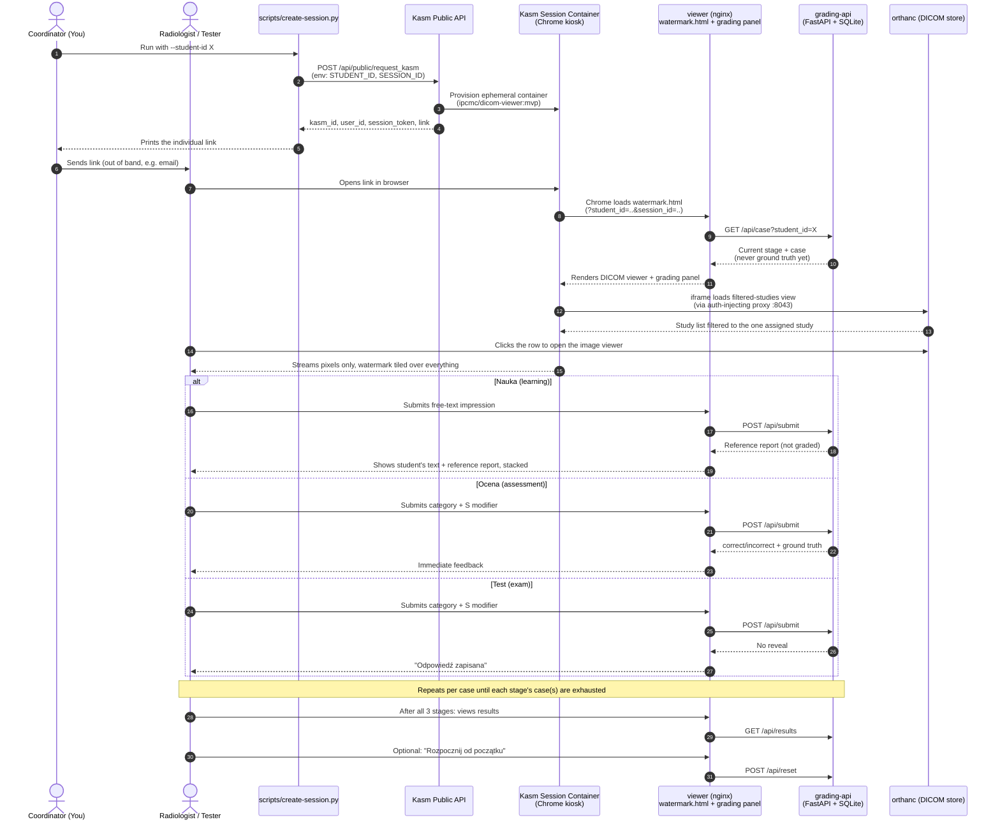
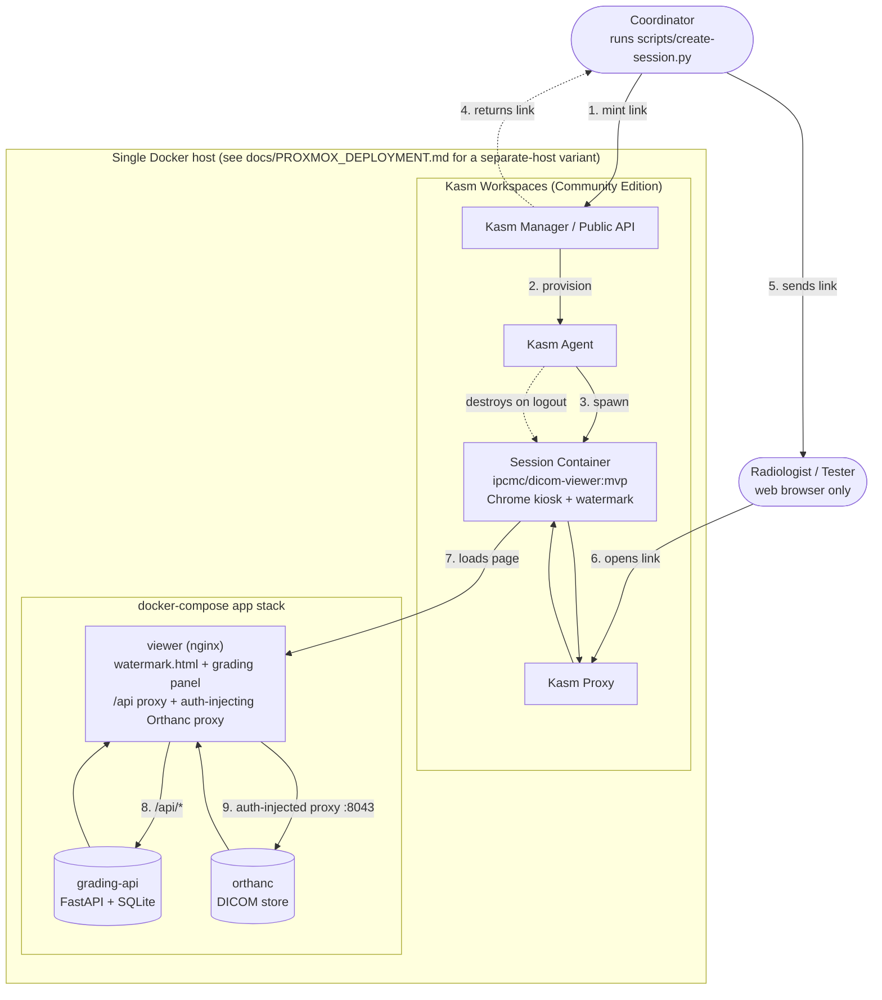
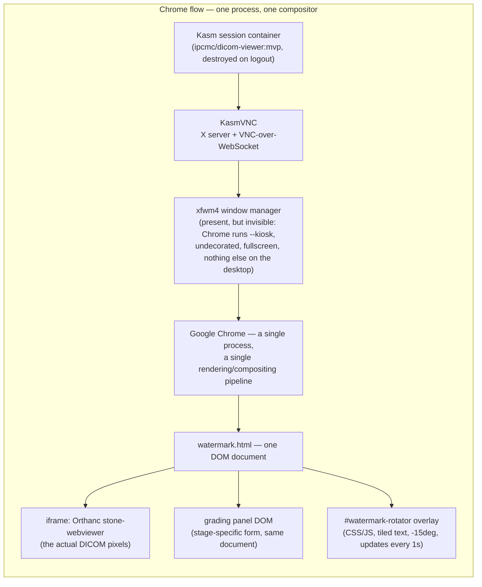
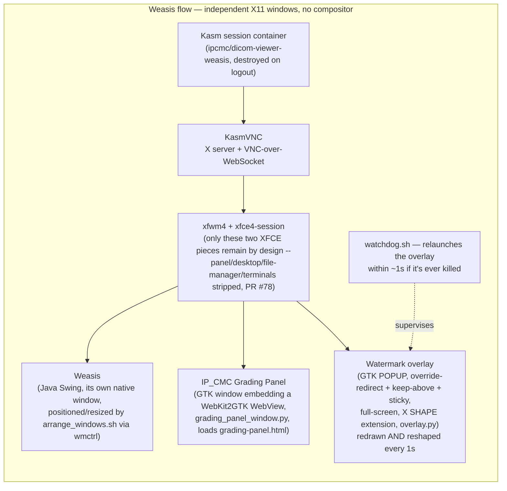

# Architecture — current state

**This describes what's actually built and running today**, not the
target/future system. For what's deliberately deferred (Moodle, payments,
real stratified sampling, certificates, admin dashboard), see README.md's
"What's NOT in this MVP" section and CLAUDE.md's hard rules — not
duplicated here to avoid the two documents drifting apart again.

## Session flow

```mermaid
sequenceDiagram
    autonumber
    actor Coordinator as Coordinator (You)
    actor Student as Radiologist / Tester
    participant CreateSession as scripts/create-session.py
    participant KasmAPI as Kasm Public API
    participant KasmSession as Kasm Session Container<br/>(Chrome kiosk)
    participant Nginx as viewer (nginx)<br/>watermark.html + grading panel
    participant GradingAPI as grading-api<br/>(FastAPI + SQLite)
    participant Orthanc as orthanc (DICOM store)

    Coordinator->>CreateSession: Run with --student-id X
    CreateSession->>KasmAPI: POST /api/public/request_kasm<br/>(env: STUDENT_ID, SESSION_ID)
    KasmAPI->>KasmSession: Provision ephemeral container<br/>(ipcmc/dicom-viewer:mvp)
    KasmAPI-->>CreateSession: kasm_id, user_id, session_token, link
    CreateSession-->>Coordinator: Prints the individual link
    Coordinator->>Student: Sends link (out of band, e.g. email)

    Student->>KasmSession: Opens link in browser
    KasmSession->>Nginx: Chrome loads watermark.html<br/>(?student_id=..&session_id=..)
    Nginx->>GradingAPI: GET /api/case?student_id=X
    GradingAPI-->>Nginx: Current stage + case<br/>(never ground truth yet)
    Nginx-->>KasmSession: Renders DICOM viewer + grading panel
    KasmSession->>Orthanc: iframe loads filtered-studies view<br/>(via auth-injecting proxy :8043)
    Orthanc-->>KasmSession: Study list filtered to the one assigned study
    Student->>Orthanc: Clicks the row to open the image viewer
    KasmSession-->>Student: Streams pixels only, watermark tiled over everything

    alt Nauka (learning)
        Student->>Nginx: Submits free-text impression
        Nginx->>GradingAPI: POST /api/submit
        GradingAPI-->>Nginx: Reference report (not graded)
        Nginx-->>Student: Shows student's text + reference report, stacked
    else Ocena (assessment)
        Student->>Nginx: Submits category + S modifier
        Nginx->>GradingAPI: POST /api/submit
        GradingAPI-->>Nginx: correct/incorrect + ground truth
        Nginx-->>Student: Immediate feedback
    else Test (exam)
        Student->>Nginx: Submits category + S modifier
        Nginx->>GradingAPI: POST /api/submit
        GradingAPI-->>Nginx: No reveal
        Nginx-->>Student: "Odpowiedź zapisana"
    end

    Note over Student,GradingAPI: Repeats per case until each stage's case(s) are exhausted
    Student->>Nginx: After all 3 stages: views results
    Nginx->>GradingAPI: GET /api/results
    Student->>Nginx: Optional: "Rozpocznij od początku"
    Nginx->>GradingAPI: POST /api/reset
```

Key differences from the original design discussion worth calling out
explicitly: no Moodle launches this (a coordinator runs
`create-session.py` by hand), no payment gate, no LTI grade passback, and
`GET /case` / `POST /submit` enforce that ground truth and the reference
report are never sent to the browser before the stage that's supposed to
reveal them — that rule lives in `grading-api/app/main.py`, not just this
diagram.

## Deployment topology

```mermaid
%%{init: {'flowchart': {'nodeSpacing': 65, 'rankSpacing': 75}}}%%
flowchart TD
    Coordinator(["Coordinator<br/>runs scripts/create-session.py"])
    Student(["Radiologist / Tester<br/>web browser only"])

    subgraph Host["Single Docker host (see docs/PROXMOX_DEPLOYMENT.md for a separate-host variant)"]
        subgraph KasmInfra["Kasm Workspaces (Community Edition)"]
            KasmProxy["Kasm Proxy"]
            KasmAPI["Kasm Manager / Public API"]
            KasmAgent["Kasm Agent"]
            KasmContainer["Session Container<br/>ipcmc/dicom-viewer:mvp<br/>Chrome kiosk + watermark"]
        end

        subgraph AppStack["docker-compose app stack"]
            Viewer["viewer (nginx)<br/>watermark.html + grading panel<br/>/api proxy + auth-injecting Orthanc proxy"]
            GradingAPI[("grading-api<br/>FastAPI + SQLite")]
            Orthanc[("orthanc<br/>DICOM store")]
        end
    end

    Coordinator -->|"1. mint link"| KasmAPI
    KasmAPI -->|"2. provision"| KasmAgent
    KasmAgent -->|"3. spawn"| KasmContainer
    KasmAPI -.->|"4. returns link"| Coordinator
    Coordinator -->|"5. sends link"| Student

    Student -->|"6. opens link"| KasmProxy
    KasmProxy --> KasmContainer
    KasmContainer --> KasmProxy
    KasmContainer -->|"7. loads page"| Viewer
    Viewer -->|"8. /api/*"| GradingAPI
    GradingAPI --> Viewer
    Viewer -->|"9. auth-injected proxy :8043"| Orthanc
    Orthanc --> Viewer

    KasmAgent -.->|"destroys on logout"| KasmContainer
```

"Single Docker host" is currently this dev laptop, not yet anything
reachable from the GUMed/UCK network — see `docs/PROXMOX_DEPLOYMENT.md`
for the separate-host variant. Kasm Workspaces is installed as Community
Edition, which comes with real licensing constraints (non-commercial-use
restriction, 5-concurrent-session cap) — see CLAUDE.md's hard rules, not
this diagram, for the authoritative statement of those.

Notes on what this diagram deliberately does *not* show, because it
doesn't exist yet: Moodle, a payment gateway, LTI Advantage, a
Postgres/stratified-sampling layer, a Proxmox cluster (this is one host).
Each of those is a real, tracked gap — see README.md and CLAUDE.md, not
this diagram, for the authoritative list so the two don't drift apart.

Separately, a **Weasis-based session flow is being built alongside this
one** (milestone "Weasis viewer migration", GitHub issues #3-#8) — a second
Kasm workspace image (`docker/kasm-workspace-weasis/`) now auto-launches
Weasis against the assigned study, displays the grading panel in its own
window, and runs the native watermark overlay (see the layer breakdown
below — none of that was true the last time this note was written). What's
still missing is automation: `scripts/create-session.py` and the main
`docker-compose.yml` only know about the Chrome workspace, so today a
coordinator would have to register/launch the Weasis workspace by hand in
Kasm's own admin UI rather than getting a minted link the same way. Both
diagrams above still describe the Chrome+Orthanc flow because that's the
only one wired into the automated per-student link path; they'll be
redrawn once `create-session.py` can mint links for either workspace.

## Display layer stack — what the user actually sees

Both flows end in "pixels inside a KasmVNC-streamed browser tab," but
*how* those pixels get composited is structurally different between them —
worth spelling out explicitly, because that difference is also the root
cause of at least one real, currently-open display bug (see below).

```mermaid
flowchart TD
    subgraph Chrome["Chrome flow — one process, one compositor"]
        direction TB
        C1["Kasm session container<br/>(ipcmc/dicom-viewer:mvp, destroyed on logout)"]
        C2["KasmVNC<br/>X server + VNC-over-WebSocket"]
        C3["xfwm4 window manager<br/>(present, but invisible: Chrome runs --kiosk,<br/>undecorated, fullscreen, nothing else on the desktop)"]
        C4["Google Chrome — a single process,<br/>a single rendering/compositing pipeline"]
        C5["watermark.html — one DOM document"]
        C6["iframe: Orthanc stone-webviewer<br/>(the actual DICOM pixels)"]
        C7["grading panel DOM<br/>(stage-specific form, same document)"]
        C8["#watermark-rotator overlay<br/>(CSS/JS, tiled text, -15deg, updates every 1s)"]
        C1 --> C2 --> C3 --> C4 --> C5
        C5 --> C6
        C5 --> C7
        C5 --> C8
    end
```

```mermaid
flowchart TD
    subgraph Weasis["Weasis flow — independent X11 windows, no compositor"]
        direction TB
        W1["Kasm session container<br/>(ipcmc/dicom-viewer-weasis, destroyed on logout)"]
        W2["KasmVNC<br/>X server + VNC-over-WebSocket"]
        W3["xfwm4 + xfce4-session<br/>(only these two XFCE pieces remain by design --<br/>panel/desktop/file-manager/terminals stripped, PR #78)"]
        W4["Weasis<br/>(Java Swing, its own native window,<br/>positioned/resized by arrange_windows.sh via wmctrl)"]
        W5["IP_CMC Grading Panel<br/>(GTK window embedding a WebKit2GTK WebView,<br/>grading_panel_window.py, loads grading-panel.html)"]
        W6["Watermark overlay<br/>(GTK POPUP, override-redirect + keep-above + sticky,<br/>full-screen, X SHAPE extension, overlay.py)<br/>redrawn AND reshaped every 1s"]
        W7["watchdog.sh — relaunches the overlay<br/>within ~1s if it's ever killed"]
        W1 --> W2 --> W3
        W3 --> W4
        W3 --> W5
        W3 --> W6
        W7 -. supervises .-> W6
    end
```

The Chrome flow's three visible pieces (viewer iframe, grading panel,
watermark) are DOM elements inside **one** document, painted by **one**
browser compositor in a single atomic frame. There is no window stacking
to arbitrate and no exposure/redraw handshake between independent
processes — the watermark's per-second re-render is just another DOM
repaint, invisible as a discrete event.

The Weasis flow has none of that: Weasis, the grading panel, and the
watermark overlay are three **separate X11 clients**, stacked and
arbitrated by `xfwm4` with **no compositor running** (see `overlay.py`'s
own header comment — that's a deliberate choice, since CSS-style alpha
blending has no real equivalent without one). Overlay transparency and
click-through are instead implemented with the X **Shape** extension:
only the actual glyph pixels are part of the watermark window at all, and
that shape is fully recomputed from scratch every second (new timestamp,
new rendered glyphs), on a window sized to the whole screen and always on
top of everything else.

**This is the mechanism behind the screen flash reported when the Weasis
workspace is enabled, and not the Chrome one**: recombining the shape of a
full-screen, always-on-top window forces the X server to treat whatever
the *previous* second's shape covered — and the *new* second's shape no
longer covers — as newly exposed, and Weasis (a Java Swing application,
running with no compositor to paper over partial repaints) has to redraw
that exposed region itself. A visible flash is that redraw handshake
between two independent, uncomposited X11 clients, playing out once a
second. The Chrome flow has no analogous moment, structurally: there's
only one compositor, and it never needs to ask a *different process* to
redraw anything.

**Not yet fixed** — this is a diagnosis, not a patch. The lowest-risk fix
that hasn't been tried yet: compute the watermark's Shape region once
(sized generously enough to cover any digit's glyph variation) instead of
recombining it every second, and only repaint pixel content inside that
fixed shape on each tick — this removes the once-a-second exposure churn
entirely without changing the forensic per-second timestamp requirement
(CLAUDE.md) at all.

**Visual regression testing does not catch this, structurally, for three
independent reasons** (`docker/viewer/tests/test_visual_regression.py`,
PR #77):
1. Those tests screenshot `watermark.html`/`grading-panel.html` directly
   via Playwright's own Chromium, outside any Kasm container — they never
   touch `xfwm4`, `overlay.py`, or Weasis's real native window at all, for
   either flow.
2. Even pointed at a live session, pixelmatch-style diffing compares two
   static single points in time. A one-frame flash is a temporal artifact
   between those two points, not a difference between them — this class
   of tool cannot see it by construction, only frame-by-frame video
   capture could.
3. The suite's own determinism trick works directly against it: it
   freezes the clock (`page.clock.set_fixed_time`) specifically so the
   once-a-second redraw never fires during a screenshot. That's what makes
   the tests reproducible, and it's exactly the mechanism that would need
   to fire for this bug to appear.
